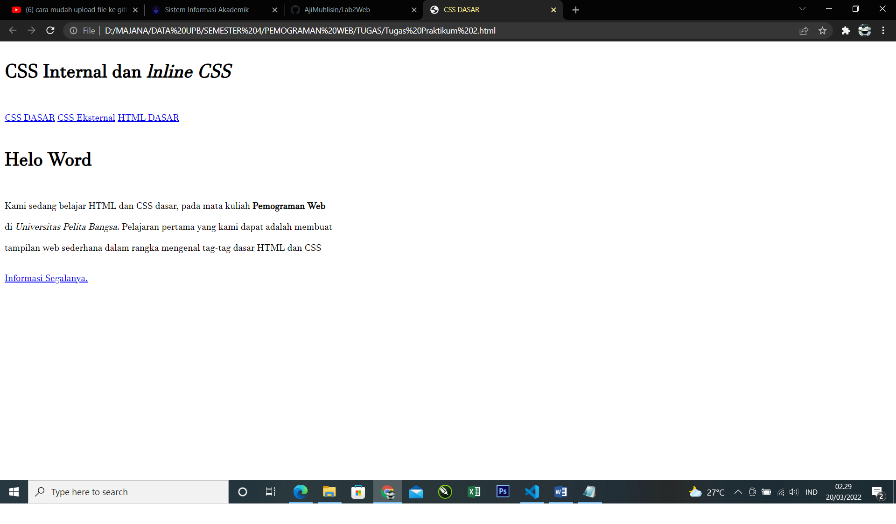
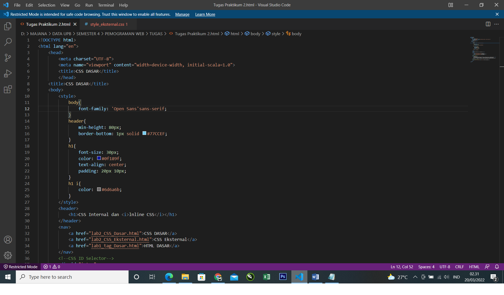
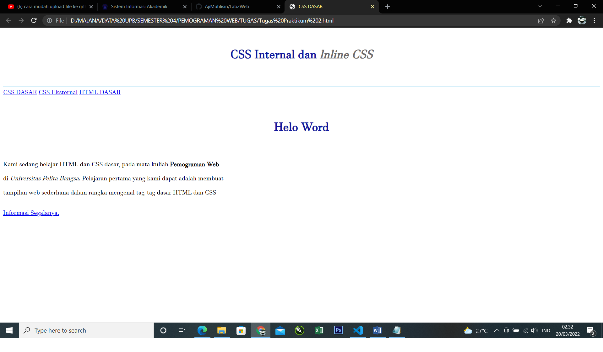
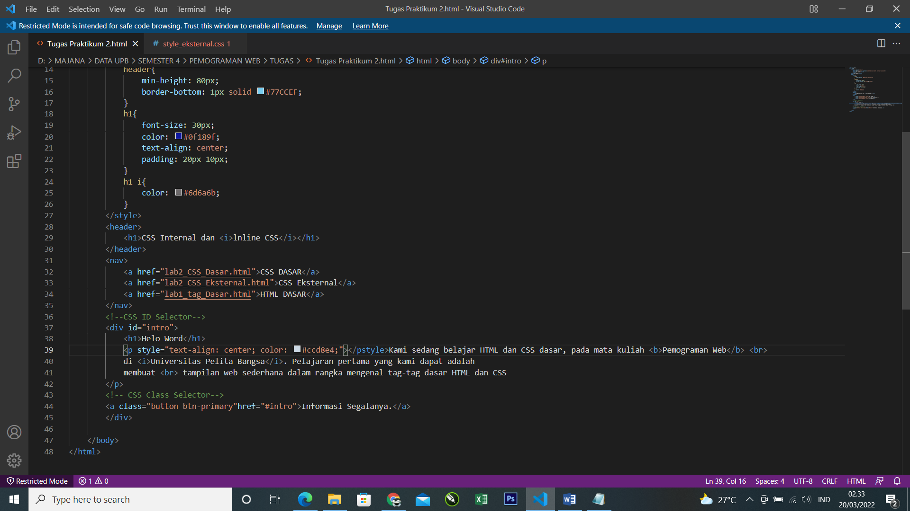
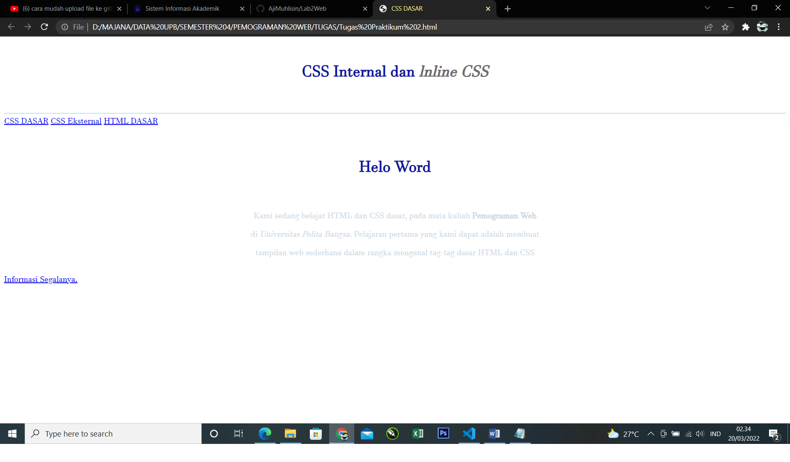
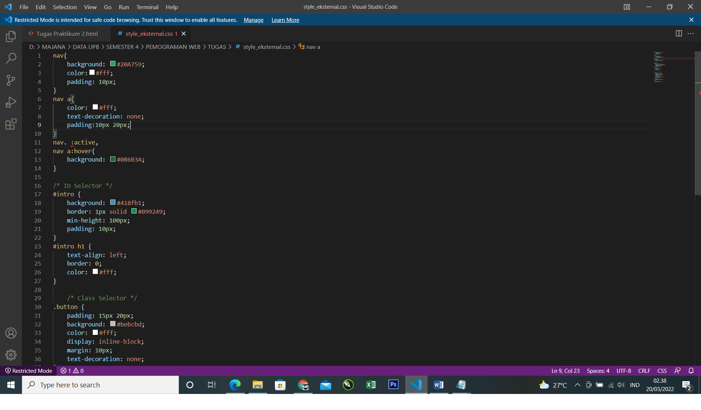
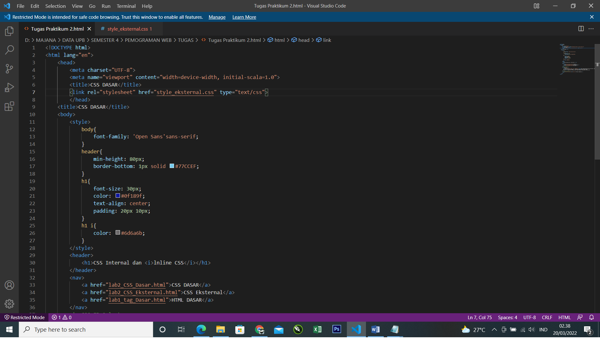
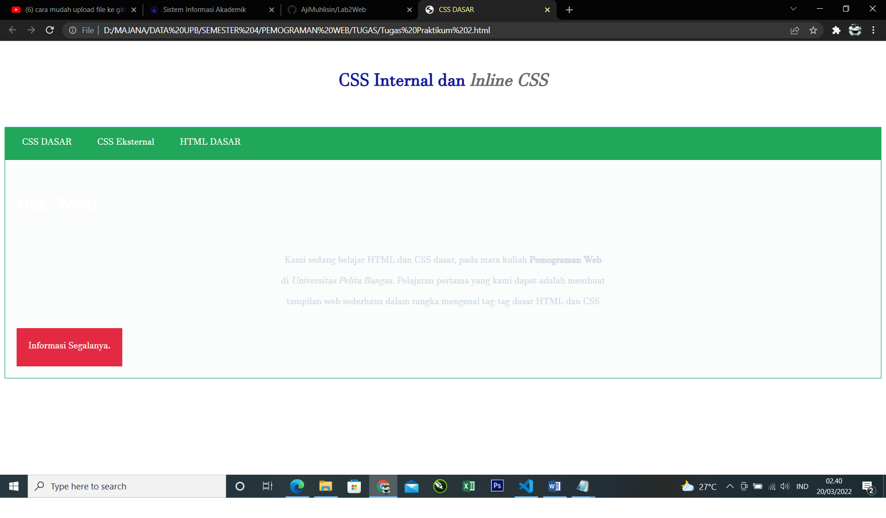
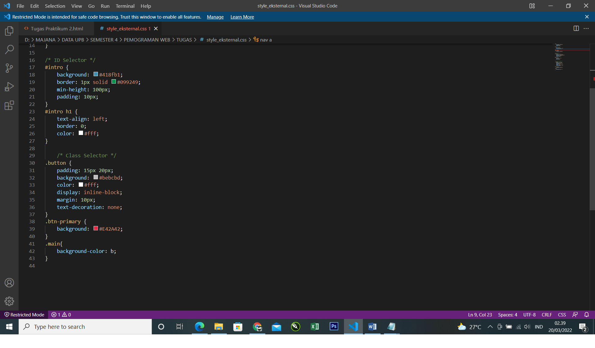

# Lab2Web
## Hasil Praktikum 2

- Berikut langkah awal elemen CSS pada tugas praktikum 2

- Berikut adalah tampilan pada web 

- Deklarasi CSS Internal seperti pada gambar berikut

- Berikut perubahan pada web, dengan judul menjadi di tengah halaman 

- Kemudian menambahkan deklarasi inline CSS pada tag 
 seperti berikut.

- Berikut perubahan pada web, paragraf menjadi transfaran

- Membuat file baru dengan nama style_eksternal.css kemudian buatlah deklarasi CSS

- Menabhkan tag <link> untuk merujuk file css yang sudah dibuat pada bagian <head>

- Berikut perubahan pada web, tampilan menu berubah menjadi berwarna

- menambahkan CSS Selector menggunakan ID dan Class Selector. Pada file style_eksternal.css, tambahkan kode berikut.

- Berikut perubahan pada web, tampilan menu berubah menjadi berwarna sesuai dengan yang diinginkan

## Jawaban Pertanyaan
1. Perubahannya yaitu menambahkan background tampilan yang tadinya putih menjadi orange, merubah ukurannya tulisan, mengubah posisi tulisan

2.	H1 untuk sub judul pada sebuah web yang dibuat sedangkan #intro h1 yaitu untuk mengatur atau membuat tampila dari judul menjadi menarik dan mengubah tampilan atau warna pada judul.

3.	Deklarasi yang akan tampil yaitu inline karena deklarasinya langsung di internal sedangkan untuk deklarsi eksternal harus ditautakan terlebih dahulu dengan deklarasi internalnya baru bisa tampil di browser
Contoh :
<!--<!DOCTYPE html>
<html lang="en">
    <head>
        <meta charset="UTF-8">
        <meta name="viewport" content="width=device-width, initial-scala=1.0">
        <title>CSS DASAR</title>
        <link rel="stylesheet" href="style_eksternal.css">
        </head>

4. Selector ID yang akan tampil terlebih dahulu karena secetor ID hanya bisa digunakan satu kali dan apabila digunakan lebih dari satu kali pada halaman maka style hanya berlaku pada halaman pertama
Contoh :
<!DOCTYPE html>
<html lang="en">
    <head>
        <meta charset="UTF-8">
        <meta name="viewport" content="width=device-width, initial-scala=1.0">
        <title>CSS DASAR</title>
        <link rel="stylesheet" href="style_eksternal.css">
        </head>
    <title>CSS DASAR</title>
    <style>
Selector Class hanya digunakan pada elemen group dan Class bisa digunakan berulangkali pada sebuah dokumen web
Contoh :
<body>
        <header>
            <h1>CSS Internal dan <i>lnline CSS</i></h1>
        </header>
        <nav>
            <a href="lab2_CSS_Dasar.html">CSS DASAR</a>
            <a href="lab2_CSS_Eksternal.html">CSS Eksternal</a>
            <a href="lab1_tag_Dasar.html">HTML DASAR</a>
        </nav> -->
